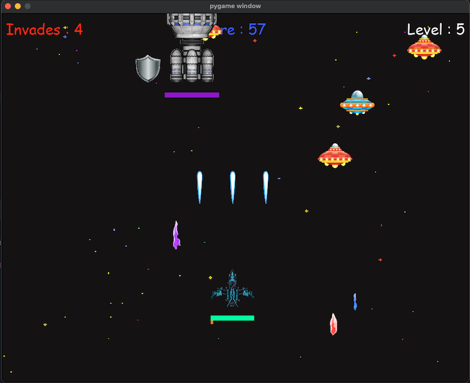

# 🚀 Space Invaders Pro

A modern remake of the classic **Space Invaders**, built with Python and [Pygame](https://www.pygame.org/). Enjoy single or two-player action, power-ups, boss battles, and more!


<!-- Add build/test/coverage badges here if available -->

---

## 🕹️ Game Overview

Classic alien-blasting arcade fun—now with:
- **Single & Two-player** modes
- Multiple enemy types & boss battles
- Score tracking
- Power-ups & more!

## 📸 Screenshots



---

## 🚀 Getting Started

### Requirements

- Python **3.11** or higher
- [Pygame](https://www.pygame.org/) (`pip install pygame`)

### Installation

1. **Clone the repository:**
    ```bash
    git clone https://github.com/udivak/Space-Invaders-Pro.git
    cd Space-Invaders-Pro
    ```

2. **Install dependencies:**
    run Space Invaders Pro.exe


3. **Enjoy!**

